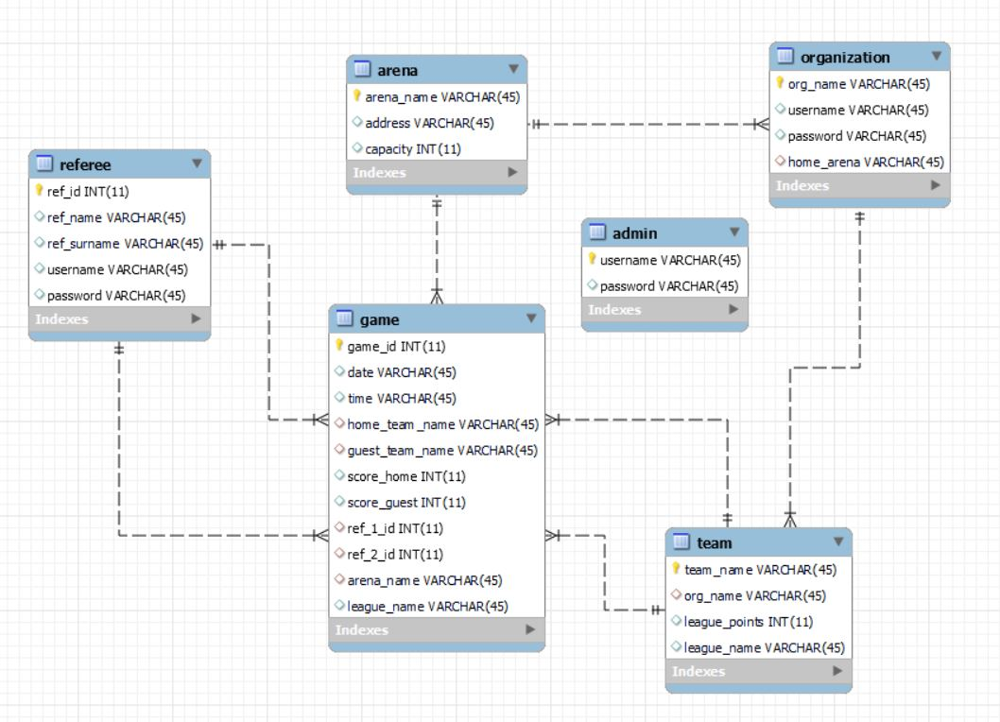
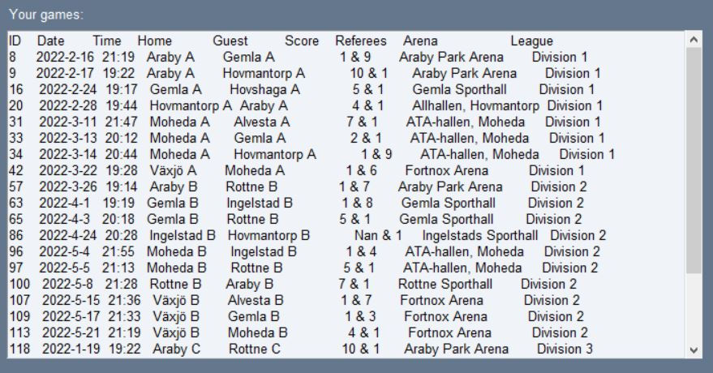

# Programming Assignment 2 Report

**Student:** Anton Zaitsev - *[az222hr@student.lnu.se](az222hr@student.lnu.se)*

## Project Idea
For this assignment I have designed and implemented a database for managing 
sports leagues in floorball (could be used for some other sports as well).
Additionally, I have created a program where users in different roles can
log in and in different ways manipulate some data as well as view tables.

The database together with the program helps visualize and manage 
organization of games. This lets referees find and apply for games and lets
organizations report game scores. Furthermore, admins can add new arenas,
referees and organizations.

This is basically how it would work in the real world with
the exception that there would be some sort of validation system making sure that
organizations do not report false scores. But since this is designed more towards low 
level local leagues where people play for fun I think that reporting scores is unnecessary.  

## Schema design
The schema design is as follows:

- **Organization** has a org. name as well as the name of the home arena
since there can be multiple orgs. that have the same home arena.
- **Team** has a name, an org. tied to the team, a league that they played in
and the amount of points they have in that league. The key is the *team name* since it
is something unique.
- **Game** has all the attributes that a game would have such as the ref. ids (1 and 2), the names of the teams
playing (home and guest), the arena, the date and time and the league. Additionally, every game also has a key
which is a game id.
- **Referee** has a unique ref. id, name and surname. Where the ref. id is the key.
- **Arena** has a name, an address and some capacity (audience).

The id's for referees and games are auto incremented. It makes everything much easier 
when adding new referees and games. 

For **organization** and **referee** there are username and password attributes stored. 
Furthermore, I have added a table **admin** to store the admins username and password.

The tables:  


In the beginning the design also had a table **league** (with attributes name and season) 
but after some thinking it made writing the queries difficult. To add to that we already have the
date for each match so adding a season to every league would just be superfluous.  

## SQL Queries
- Q1: This query selects all atrributes of a game given a ref. id. We use the 
*coalesce()* and *concat()* functions. *Coalesce* gives us the first not null 
argument, so if there is no ref on place one we recive "NaN". The *concat()* function 
concatinates the two ref. ids or the string "NaN". We pass the argument of the 
ref. id (marked with ! in the query) and the query should give us all the games of 
that referee.

```mysql
select game_id, date, time, home_team_name,
guest_team_name, concat(score_home,"-",score_guest),
concat(coalesce(ref_1_id,"Nan")," & ",coalesce(ref_2_id,"NaN")),
arena_name, league_name 
from game where ref_1_id = ! or ref_2_id = !
```

Result:  


- Q2: The following query is a multirelation query and uses *join*. It should give us
the name, surname and amount of games of the refeere with the most total amount of 
games. We join table referee on table game by matching the referee.ref_id to either 
the game.ref_1_id or the game.ref_1_id. We use the *count* function to count the 
amount of times a referee is found and then we can group it by the name and order 
it by that count in a descending fashion. By limiting the table to one we get the 
referee with the most amount of games.

```mysql
select concat(ref_name," ",ref_surname) as name, count(ref_id) as ref_id_count
from referee join game on game.ref_1_id = referee.ref_id
or game.ref_2_id = referee.ref_id
group by name
order by ref_id_count desc 
limit 1
```

Result:  


- Q3: The following query is a multirelation query and uses *join*. We pass the argument 
of the team name (marked with ! in the query) and the query should give us a *distinct* 
arena. We join table Arena on table Organization by matching the arena.arena_name to 
the organization.home_arena. Furthermore, we join that table on the table Team by 
matching the organization.org_name to the team.org_name.

```mysql
select distinct arena_name 
from arena join organization on 
organization.home_arena = arena.arena_name join 
team on team.org_name = organization.org_name 
where team_name = !
```


- Q4: In this query we create a view that is going to be used by the organizations.

```mysql 
create view org_view_games as 
select * from game
```


- Q5: In this query we use the view that was created and updated it with a score for 
the home (h) and guest (g) team with a given game id (id).
```mysql
update org_view_games 
set score_home = h,
score_guest = g 
where game_id = id
```


- Q6: In this query we select the difference between the *max* and *min* points from 
a given league (l). 

```mysql
select max(league_points) - min(league_points) 
from team 
where league_name = l
```


- Q7: The following query updates the points that a team (marked !) has in a league. 
Since it is in this case a win, three points are added. In case of a tie only one 
point is added.

```mysql
update org_view_teams 
set league_points = league_points + 3 
where team_name = !

```

## Discussion and Resources
There might be some bugs regarding the gui since I did not have time to test all input
possibilities. So if the program crashes see it more as a feature (that tells you that 
you did something wrong) rather than an error. :-)   

[Video demo.](https://www.youtube.com/watch?v=qc31nHPgfX4)
 
